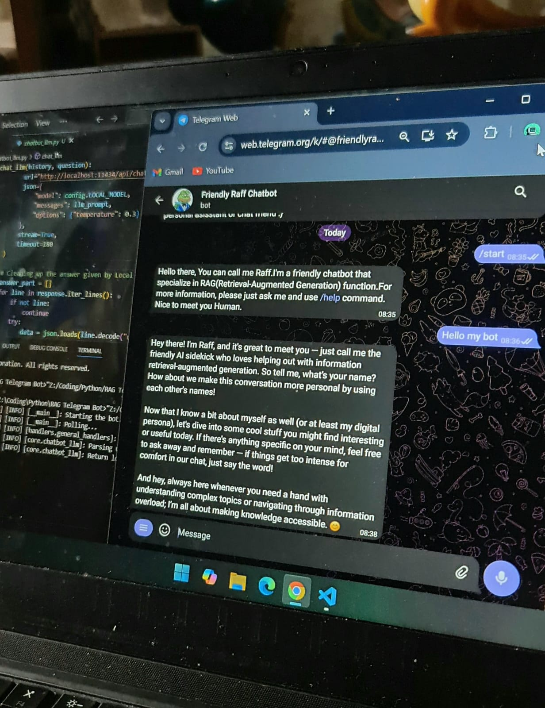
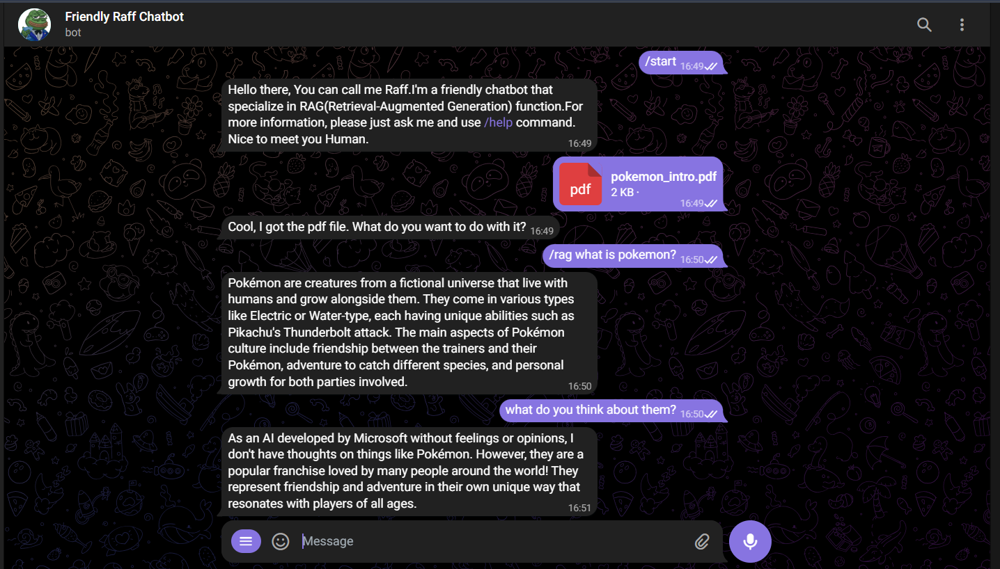

# [🤖Telegram_RAG_ChatBot](https://github.com/YandLim/Telegram-RAG-ChatBot)
Start: 01/11/25 | Finish: 13/11/25

A Telegram bot that connects to a local AI on your machine.
It reads your PDF files, understands the content, and replies to your questions using RAG (Retrieval-Augmented Generation).
The bot runs through Telegram, but all the AI processing — text extraction, embeddings, vector search, and generation — happens locally.

## ✨ The story behind the project
Ever had a PDF with tons of information, but you only need one thing from it?
It’s nice having all that data, but it gets annoying when you don’t know where to find what you’re looking for.
That’s when the idea hit me — “ChatGPT can do this, but it’s not free… so what if I make my own version? Something local, free, and just for me.”

Honestly, the idea of having my own LLM running right on my laptop sounded too cool to ignore.
So I built one — a fully local RAG LLM that can even handle normal chit-chat.
Using Telegram as the frontend and Python + Ollama for the local model, I made a Telegram RAG chatbot that finally does exactly what I wanted — simple, fast, private, and mine.

## 📋 Features
- Send and process PDF files directly in Telegram
- Ask questions and get context-based answers
- Uses local FAISS database for fast and accurate retrieval
- Powered by RAG, combining retrieval and generation
- Keeps conversation history for smoother context
- No API keys, no cloud calls — everything happens on your machine

## 🖨️ Output
 

 
<i>Bot responding as chatbot without any context.</i>

 

 
<i>Bot responding to a question based on uploaded PDF.</i>

## ⚙️ How it works
- Send a PDF file to the bot
- The bot extracts and splits the text into smaller parts
- Each part is turned into embeddings and saved inside FAISS
- When you ask a question, it finds similar chunks
- The local LLM (like Gemma or Mistral) generates a response based on that context
- The answer is sent back to you in Telegram

## 🧰 Tech Stack
- Python
- python-telegram-bot – for Telegram integration
- FAISS – vector database for similarity search
- Sentence Transformers – for embeddings
- Local LLM – Gemma, Mistral, or any supported model

## 🧩 Strengths
- Runs locally — your data stays with you
- Clear and simple structure, easy to extend
- Lightweight and privacy-friendly
- Conversation feels natural through Telegram

## ⚠️ Limitations
- Only supports PDF files for now
- Accuracy depends on your hardware and model
- Telegram needs internet, but AI stays offline

## 🫡 What I learned
- RAG becomes much more meaningful when connected to a real interface
- FAISS can handle large data surprisingly fast
- Simple bots can feel alive when powered by local AI
- Separating local logic from the Telegram layer keeps things clean
